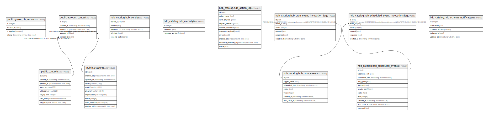

# db

## Tables

| Name | Columns | Comment | Type |
| ---- | ------- | ------- | ---- |
| [public.goose_db_version](public.goose_db_version.md) | 4 |  | BASE TABLE |
| [public.contacts](public.contacts.md) | 8 |  | BASE TABLE |
| [public.accounts](public.accounts.md) | 10 |  | BASE TABLE |
| [public.account_contact](public.account_contact.md) | 5 |  | BASE TABLE |

## Relations

---

> Generated by [tbls](https://github.com/k1LoW/tbls)
