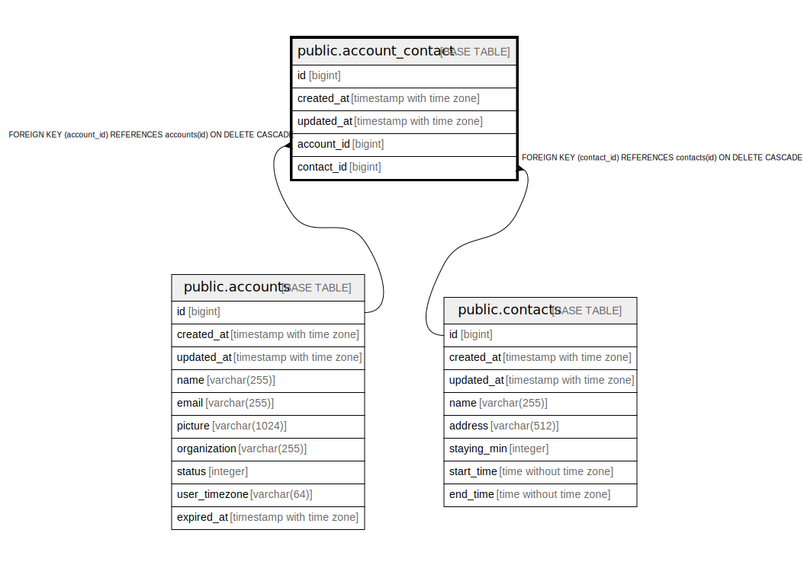

# public.account_contact

## Description

## Columns

| Name | Type | Default | Nullable | Children | Parents | Comment |
| ---- | ---- | ------- | -------- | -------- | ------- | ------- |
| id | bigint | nextval('account_contact_id_seq'::regclass) | false |  |  |  |
| created_at | timestamp with time zone | now() | false |  |  |  |
| updated_at | timestamp with time zone | now() | false |  |  |  |
| account_id | bigint |  | false |  | [public.accounts](public.accounts.md) |  |
| contact_id | bigint |  | false |  | [public.contacts](public.contacts.md) |  |

## Constraints

| Name | Type | Definition |
| ---- | ---- | ---------- |
| account_contact_contact_id_fkey | FOREIGN KEY | FOREIGN KEY (contact_id) REFERENCES contacts(id) ON DELETE CASCADE |
| account_contact_account_id_fkey | FOREIGN KEY | FOREIGN KEY (account_id) REFERENCES accounts(id) ON DELETE CASCADE |
| account_contact_pkey | PRIMARY KEY | PRIMARY KEY (id) |
| account_contact_account_id_contact_id_key | UNIQUE | UNIQUE (account_id, contact_id) |

## Indexes

| Name | Definition |
| ---- | ---------- |
| account_contact_pkey | CREATE UNIQUE INDEX account_contact_pkey ON public.account_contact USING btree (id) |
| account_contact_account_id_contact_id_key | CREATE UNIQUE INDEX account_contact_account_id_contact_id_key ON public.account_contact USING btree (account_id, contact_id) |

## Relations

---

> Generated by [tbls](https://github.com/k1LoW/tbls)
