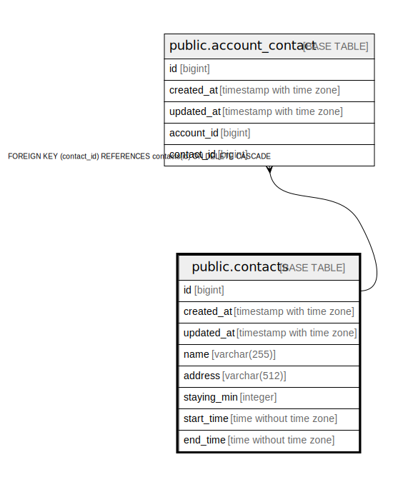

# public.contacts

## Description

## Columns

| Name | Type | Default | Nullable | Children | Parents | Comment |
| ---- | ---- | ------- | -------- | -------- | ------- | ------- |
| id | bigint | nextval('contacts_id_seq'::regclass) | false | [public.account_contact](public.account_contact.md) |  |  |
| created_at | timestamp with time zone | now() | false |  |  |  |
| updated_at | timestamp with time zone | now() | false |  |  |  |
| name | varchar(255) |  | false |  |  |  |
| address | varchar(512) |  | false |  |  |  |
| staying_min | integer |  | false |  |  |  |
| start_time | time without time zone |  | false |  |  |  |
| end_time | time without time zone |  | false |  |  |  |

## Constraints

| Name | Type | Definition |
| ---- | ---- | ---------- |
| contacts_pkey | PRIMARY KEY | PRIMARY KEY (id) |

## Indexes

| Name | Definition |
| ---- | ---------- |
| contacts_pkey | CREATE UNIQUE INDEX contacts_pkey ON public.contacts USING btree (id) |

## Relations

---

> Generated by [tbls](https://github.com/k1LoW/tbls)
